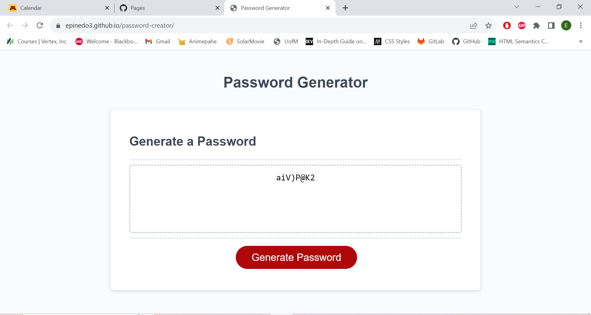

# password-creator

## Description

The purpose of this Challenge-3 was to create a Password Generator. Using a starting code that was provided. I had to clone it, and edit it to meet my code needs. In this challenge we were introduced to "var", "if", and other synthax I was not used to. Thanks to this challenge I believe to have a better understanding of how javascript works.

## Installation
In order to install this repository you will need to navigate into my github "https://github.com/epinedo3/password-creator". Once you are there, look for the green code button. Copy the HTTPS link that is provided. Enter your local gitbash/terminal. Once you are in your desired destination folder. Type in the git clone command and paste the provided link. Execute and Enjoy.

## Usage
To find my github, click [here](https://github.com/epinedo3/password-creator).

To find my deployed website, click [here]( https://epinedo3.github.io/password-creator/).

## Screenshot

## Credits
N/A

## License

Please refer to the LICENSE in the repo.